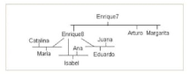

# Arbol genealógico del Rey Enrique 7mo. de Inglaterra.

## Hecho por Juan Pablo de Jesus Figueroa Jaramillo

#
### Estructura

- Ejemplo.pl

### Como iniciar ?

1. Clona el repositorio de github
2. Dirigete a la carpeta Actividad 2 con el comando cd Actividad 2/
3. Una vez dentro de la carpeta en la terminal, corremos el comando:

            swipl -s Ejemplo.pl

4. Mirando el arbol genelogico puedes crear tus preguntas acerca de los hechos que se pusieron en el documento.

    
