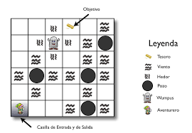

# El mundo de Wumpus

## Hecho por Juan Pablo de Jesus Figueroa Jaramillo

#
### Reglas del juego

El  juego  es  desarrollado  en  un  tablero  de  dimensiones  variables, generalmente cuadricular. El  juego  es  desarrollado  en  un  tablero  de  dimensiones  variables, generalmente   cuadricular.   Encontraremos   ciertos   elementos   que   se distribuirán por todo el tablero, éstos serán: 
-   Aventurero. 
-   Wumpus 
-   Tesoros.
-   Pozos o Agujeros. 
-   Existencia de Viento. 
-   Existencia de Hedor. 
- Existencia de Hedor y Viento. 
- Casillas de Entrada y Salida. 

El  objetivo  del  juego  es  sencillo.  El  Aventurero  debe  de  buscar  por  el tablero  un  tesoro  y  salir  sin  ser  devorado  por  el  Wumpus  o  caer  en  ningún pozo. Expresado en términos heurísticos, el Aventurero deberá encontrar el camino  óptimo  para  realizar  su  cometido  sin  ser  devorado  o  caer  en  algún pozo. 

### Descripción de los Elementos del Tablero

#### Casilla

Las  casillas  y  sus  elementos  son  designados  por  el  diseñador  del problema, es decir, no hay un tablero único para este juego. Podría decirse que son ilimitados los escenarios que pueden diseñarse [2].Las casillas que el diseñador puede colocar son: 
-   Casilla de Entrada. 
-   Casilla de Salida. 
- Casilla del Wumpus. 
- Casillas de Pozos. 
-   Casillas de Tesoros. 

Estas casillas son impuestas libremente por el diseñador, sin embargo las restantes se colocan siguiendo unas normas.

1. Casilla  de  Hedor:  son  colocadas  en  las  casillas  adyacentes  al Wumpus. 
2.  Casilla  de  Viento:  son  colocadas  en  las  casillas  adyacentes  a Pozos.
3.  Casilla de Hedor y Viento: son las resultantes de la combinación de las anteriores, ya que es posible esta posibilidad.

### Aventurero

Es el agente que se moverá por el tablero. Deberá salir victorioso del tablero consiguiendo un tesoro. Cuando los algoritmos de Búsqueda Heurística decidan  el  siguiente  paso  a  seguir,  será  éste  el  que  se  moverá  según  sus órdenes. Sin embargo, él será el que percibirá la heurística que implicará uno u  otro  paso.  Cuando  llegue  a  una  casilla,  indicará lo  que  percibe  en  ella, pudiendo ser las siguientes posibilidades: 
- El agente percibe si en su casilla se encuentra el Wumpus. 
- El agente percibe en su casilla Hedor, por tanto hay un Wumpus en las casillas adyacentes. 
- El  agente  percibe  en  su  casilla  Viento,  por  tanto  hay  un  Pozo  en  las casillas adyacentes. 
- El agente percibe si en su casilla se encuentra el tesoro. 
-   El agente percibe si en su casilla hay un pozo o agujero. 
- El agente puede percibir un grito desde su casilla.

En función de lo que perciba, el aventurero reaccionará de una manera u otra, muriendo o actualizando su información Heurística. Las vidas o intentos que  tiene  el  aventurero  para  resolver  el  problema, es  decir,  las  veces  que puede morir, son limitadas por el usuario, aunque clásicamente tiene intentos ilimitados. Además dispone de una Flecha, aunque del mismo modo pueden añadirse más, para defenderse del Wumpus. 

El Aventurero podrá realizar las siguientes acciones:

- Moverse en dirección Norte, Sur, Este y Oeste, pero nunca en diagonal. 
- Disparar  en  las  direcciones  de  movimiento  una  flecha  para  matar  al Wumpus cuando quiera.  
- Coger el Tesoro. •Morirá devorado si cae en la casilla del Wumpus, estando éste vivo. 
- Morirá al caer por un pozo si cae en una casilla de este tipo. 
- Si  el  agente  muere  de  una  de  las  anteriores  maneras,  volverá  a  la casilla de Entrada sin perder el conocimiento obtenido del mapa. 
- Modificará  su  información  heurística  cuando  perciba  algo,  así  como memorizará los elementos visitados o deducidos. 
- Entrará por la casilla de Entrada y saldrá por la casilla de Salida, que pueden ser la misma.

### Wumpus

Es el nombre del juego y representa el monstruo que hay en el mapa. En el problema clásico su existencia está limitada a una unidad. Sin embargo, puede  modificarse  para  que  haya  varios,  complicando  así  la  resolución  del problema. Su posición es estática, es decir, no se moverá durante el juego. Sin embargo, puede modificarse el juego si se permite que el Wumpus tenga movilidad,  complicando  aún  más  su  ejecución,  ya  que  haría  falta  otro algoritmo que lo moviera a él (o a ellos). Alrededor de su posición generará hedor, provocando la aparición de las casillas de Hedor que darán información al Aventurero de que el Wumpus se encuentra por los alrededores. 

### Tesoro

Encontrar  el  tesoro  es  el  primer  objetivo  que  ha  de  alcanzar  el Aventurero.  Este  elemento  puede  repetirse  un  número  limitado  de  veces, impuesto por el diseñador. Cuantos más tesoros haya, más fácil le resultará al Aventurero  lograr  su  primer  objetivo,  ya  que  el  segundo  es  salir  vivo  del tablero. 

Su posición es estática en todo momento, y esta casilla desaparecerá sólo si el tesoro es recogido por el Aventurero. Puede darse la situación en que el Aventurero lleve el tesoro y caiga por un Pozo o sea devorado por el Wumpus. En este caso, la casilla del Tesoro se regenerará en su posición original.

### Pozos

on uno de los elementos que debe esquivar el Aventurero. Su posición es estática una vez que ha sido establecida y no podrá modificarse. Su número es  ilimitado,  aunque  evidentemente,  cuantos  más  agujeros  haya  más complicado  será  el  tablero.  Habrá  Viento  por  los  alrededores  de  los  Pozos, siendo éste uno de los factores que percibirá el Aventurero para deducir sus posiciones. Si cae por un Pozo, el aventurero morirá. 

